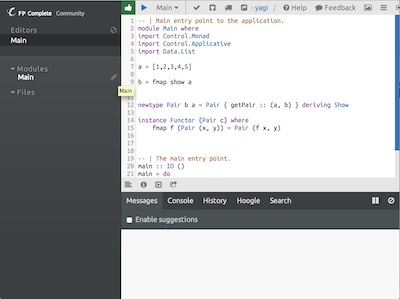
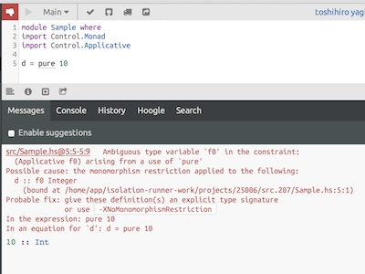
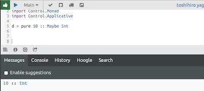
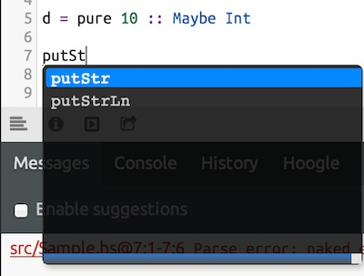

# すごいHaskell楽しく学ぼう！輪読会
http://sugoihaskell.github.io/

2014/3/24 by [@sys1yagi](https://twitter.com/sys1yagi)

# 第13章モナドがいっぱい 
~モナドはbindをサポートするアプリカティブファンクタにすぎない~

## WebベースのIDE「FP Complete」が捗る
Haskellを書く環境としてよさ気なのは無いかなぁといろいろ探していたら、とりあえず色々触るには[FPComplete](https://www.fpcomplete.com/)というのが良さそうでした。



### Goolgle+アカウントでログインできる
地味に助かる。すぐ始められます。


### シンタックスエラーを検出してくれる
間違っても安心。ビシバシ怒ってくれます。



修正すると緑へ。



### サジェストしてくれる

ctrl+spaceでサジェストしてくれる。捗る。



FPComplete便利ｻｲｺｰ！

## おさらい

### ファンクター

ファンクターは関数で写せるものの事。リストやMaybeなどがファンクター。ファンクターはfmapという型クラスメソッドを一つだけもつ。ファンクター則があり、それを満たす必要がある。

fmapの定義は以下の通り。「aという型を引数に取ってbという型を返す関数」と「ファンクター値 a」を受け取り、「ファンクター値 b」を返す関数である事がわかる。

```
fmap :: Functor f => (a -> b) -> f a -> f b
```

リストとfmap

```
fmap (+5) [1,2,3,4,5]
>[6,7,8,9,10]
```

Maybeとfmap

```
fmap (/4) $ Just 5
>Just 1.25

fmap (*3) Nothing
>Nothing
```

Eitherなど複数の型変数を持つ型の場合、部分適用をして一つだけ型変数を引数に取る状態にしないといけない。

```
fmap (++" Haskell!") (Left 1::Either Int String)
>Left 1

fmap (++" Haskell!") (Right "Great"::Either Int String)
>Right "Great Haskell!"
```

なぜか`Control.Applicative`に定義されている<$>演算子はfmapと同じ

```
operator = (*3) <$> [2,3,4,5,6]
>[6,9,12,15,18]

:t (<$>)
>(<$>) :: Functor f => (a -> b) -> f a -> f b
```


ファンクターは関手らしい。

```
関手（かんしゅ、functor）とは、圏の間の対応付けのことである。
```

`対象(Int、[Char]など)や射(->)の集まり`が圏らしい。ある圏Aを圏Bに対応付けるのが関手。

※以下筆者の感想であり合ってるか不明です。間違ってたらマサカリ下さい。

Maybeで考える対象の関手

```
a = 10
>a :: Integer

b = Just a
>b :: Maybe Integer

:t Just
>Just :: a -> Maybe a
```

Maybeで考える射の関手

```
{-# LANGUAGE NoMonomorphismRestriction #-}

(*2)
>(*2) :: Num a => a -> a

f = fmap (+4)
>fmap (+4) :: (Functor f, Num b) => f b -> f b

g = f $ Just 5
>Just 9
```

[参考:WIKIBOOKS Haskell/圏論](http://ja.wikibooks.org/wiki/Haskell/%E5%9C%8F%E8%AB%96)

### アプリカティブファンクター

ファンクタを更に強化したもの。アプリカティブ則があり、それを満たす必要がある。

```
アプリカティブ([形]実際に利用［使用］できる, 適用［応用］できる；実用的な.)
```

アプリカティブファンクターは２つの型クラスメソッドを持つ。

```
:t pure
>pure :: Applicative f => a -> f a 

:t (<*>)
>(<*>) :: Applicative f => f (a -> b) -> f a -> f b
```

pure: 型aを引数に取り、「アプリカティブファンクター値 a」を返す

```
import Control.Applicative

a = pure 4 :: Maybe Int
>Just 4
```

(<*>): アプリカティブファンクター値の中の関数を、「アプリカティブファンクター値 a」に適用して、「アプリカティブファンクター値 b」を返す

```
Just (*4) <*> Just 5
>Just 20
```

ファンクターやアプリカティブファンクター値を`文脈`をするなら、ファンクタは普通の関数を文脈の中に適用する。アプリカティブファンクタは文脈の中の関数を文脈の中に適用する。


### モノイド

モノイドは値を二項演算子で結合できるような型を表す。モノイド則があり、それを満たす必要がある。

```
class Monoid m where
    mempty :: m
    mappend :: m -> m -> m
    mconcat :: [m] -> m
    mconcat = foldr mappend memcpy
```

略。


## モナド

とうとうモナドに突入します。が、しかし実はもうノリは同じです。Monad型は主に2つの型クラスメソッドを持ちます。それだけです！！

```
class Monad m where
   (>>=) :: m a -> (a -> m b) -> m b
   return :: a -> m a
```

つまり、

### モナドはbind(>>=)をサポートするアプリカティブファンクタにすぎない
( ｰ`дｰ´)ｷﾘｯ

２つの型クラスメソッドのうちの一つ、returnはpureと同じです。つまり`a -> m a`なのです。

```
pure 10 :: Maybe Int
> Just 10

return 10 :: Maybe Int
> Just 10
```

ではbind(>>=)はどうでしょうか。bindは`モナド値a`と`型aのを引数に取り、モナド値bを返す関数`を引数に取り、`モナド値b`を返す関数です。

```
Just 5 >>= (\x -> Just (x + 6))
> Just 11

Nothing >>= (\x -> Just (x + 6))
>Nothing
```

`文脈`を持つ型を使って一連の処理に通し、結果を受け取るといった操作を簡潔に書けるようになります。

例えば、Intを２つ受け取り、足した数が101以上の場合Nothingを返す関数を作る。

```
addLimit100 :: Int -> Int -> Maybe Int
addLimit100 a b = if ((a + b) > 100) then Nothing else Just (a + b)
```

この様にして使う。

```
Just 10 >>= addLimit100 20
>Just 30

Just 100 >>= addLimit100 20
> Nothing
```

更につなげてこう書ける

```
Just 10 >>= addLimit100 10 >>= addLimit100 10
> Just 20
```

do記法を用いるとこうなる

```
do 
    a <- Just 10
    b <- addLimit100 10 a
    Just b
> Just 20
```

数値のリストを受け取って合算が101を以上ならNothingにする関数。

```
isOverLimit :: [Int] -> Maybe Int
isOverLimit [] = Just 0
isOverLimit (x:xs) = isOverLimit xs >>= addLimit100 x
```

こういう使い方になる。

```
i = isOverLimit [1,2,3,4,5,6,7,8,9,10]
> Just 55

j = isOverLimit [1,2,3,4,5,6,7,8,9,10,11,12,13,14,15]
> Nothing
```

もしモナドを使わずに書こうとすると...

```
isOverLimit2 :: [Int] -> Maybe Int
isOverLimit2 x = (\y -> if y > 100 then Nothing else Just y) $ foldr (+) 0 x
```

簡潔に書けた...

しかしこれではどうでしょうか!結果が異なる！！

```
isOverLimit $ reverse [1,100,-10]
>Nothing

isOverLimit2 $ reverse [1,100,-10]
>Just 91
```

`isOverLimit`では途中で100を超えた瞬間があった場合結果が`Nothing`になります。`isOverLimit2`はfoldrで合算した結果から判定をしているので、経過については意識できないのです！！！！モナドを用いる事でトランザクション的な何かを実現出来るのです！(多分)


## モナド則

Monadにもモナド則があり、それを満たす必要があります！


### 左恒等性

```
P.309
returnを使って値をデフォルトの文脈に入れたものを>>=を使って関数に食わせた結果は、単にその値にその関数を適用した結果と等しくなりなさい。
```

```
return 10 >>= (\x -> Just (x+10))
>Just 20

(\x -> Just (x+10)) 10
>Just 20
```

### 右恒等性

```
P.310
>>=を使ってモナド値をreturnに食わせた結果は、元のモナド値と普遍である
```

```
c = Just 5 >>= return
Just 5

d = [1,2,3] >>= return
[1,2,3]
```

### 結合法則

```
P.311
>>=を使ったモナド関数適用の連鎖があるときに、どの順序で評価しても結果は同じであるべき
```

```
(m >>= f) >>= g
と
m >>= (\x -> f x >>= g)
は等価
```

正直よくわからん。

## 練習問題

騎士の旅

```
P.306
チェス盤の上に無いとの駒がひとつだけ乗っています。ナイトを3回動かして特定のますまで移動させられるか、というのが問題です。チェス盤上でのナイトの位置は、単なる数のペアで表現する事にしましょう。1つ目の数が横軸、2つ目が縦軸です。
```

KnightPosという型シノニムを作り、ある位置からナイトが移動できる全てのパターンを返すmoveKnightを作ります。

```
import Control.Monad

type KnightPos = (Int, Int)

moveKnight :: KnightPos -> [KnightPos]
moveKnight (c,r) = do
    (c', r') <- [(c+2, r-1), (c+2, r+1), (c-2, r-1), (c-2, r+1)
        ,(c+1, r-2), (c+1, r+2), (c-1, r-2), (c-1, r+2)]
    guard (c' `elem` [1..8] && r' `elem` [1..8])
    return (c', r')
```

与えられた初期位置から3手で行ける位置のリストを得る関数が以下です。

```
in3 :: KnightPos -> [KnightPos]
in3 start = do
    first <- moveKnight start
    second <- moveKnight first
    moveKnight second
```

そして初期位置と終点を与えて、3手で行けるか判定する関数が以下です。

```
canReachIn3 :: KnightPos -> KnightPos -> Bool
canReachIn3 start end = end `elem` in3 start
```

動かしてみると...

```
canReachIn3 (6,2) (2,3)
>True
```

できた！！
では、次は初期位置から終点までのルートを返す関数を作ってみましょう！！！

## 解(sys1yagiの場合)

すごく頑張って元のルートを持っておく形に。脳みそが辛かったのでもっと簡単な方法があるのだと思う。

```
module Main where

import Control.Monad

type KnightPos = (Int, Int)

moveKnight :: [KnightPos] -> [[KnightPos]]
moveKnight [(c,r)] = do
    (c', r') <- [(c+2, r-1), (c+2, r+1), (c-2, r-1), (c-2, r+1)
        ,(c+1, r-2), (c+1, r+2), (c-1, r-2), (c-1, r+2)]
    guard (c' `elem` [1..8] && r' `elem` [1..8])
    return [(c', r'),(c,r)]
moveKnight (x:xs) = map (++xs) (moveKnight [x])

allRoute3 :: KnightPos -> [[KnightPos]]
allRoute3 x = do
    first <- moveKnight [x]
    second <- moveKnight first
    moveKnight second

route3 :: KnightPos -> KnightPos -> [[KnightPos]]
route3 s e = [reverse y | y <- allRoute3 s, head y == e ]
    
a = route3 (6,2) (6,1)
b = route3 (6,2) (3,2)
c = route3 (6,2) (3,1)

main = do
    print a
    print "-------------------"
    print b
    print "-------------------"
    print c
```

```
[[(6,2),(8,1),(7,3),(6,1)],[(6,2),(4,1),(5,3),(6,1)],[(6,2),(7,4),(5,3),(6,1)],[(6,2),(7,4),(8,2),(6,1)],[(6,2),(5,4),(7,3),(6,1)],[(6,2),(5,4),(4,2),(6,1)]]
"-------------------"
[[(6,2),(4,1),(5,3),(3,2)],[(6,2),(4,3),(2,4),(3,2)],[(6,2),(4,3),(5,1),(3,2)],[(6,2),(7,4),(5,3),(3,2)]]
"-------------------"
[]
```


